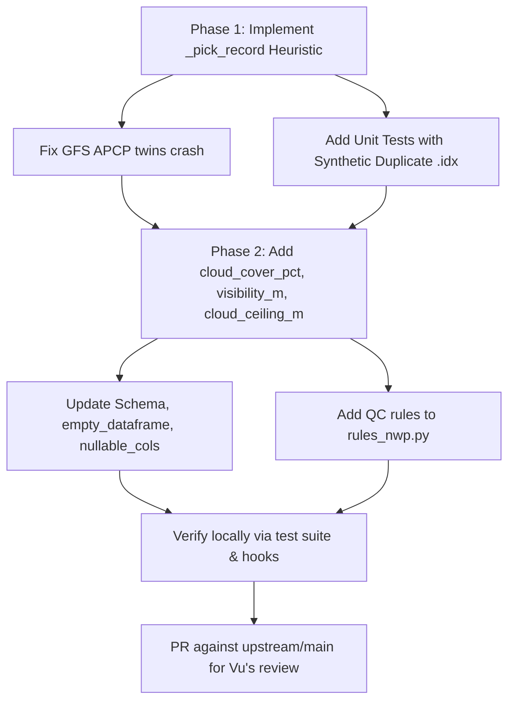

# Technical Review & Academic Synthesis: NWP Fields & Cloud Cover (Issue #63)

**Date:** 2026-06-05
**Reviewed Documents:**
1. [.briefs/github-issue-63-nwp-fields-review.md](file:///Users/zach/.openclaw/workspace/.briefs/github-issue-63-nwp-fields-review.md) — Technical review of code-level constraints, GFS precip bug, and disambiguation strategy.
2. [.briefs/cloud-cover-deep-research.md](file:///Users/zach/.openclaw/workspace/.briefs/cloud-cover-deep-research.md) — Deep academic review of cloud cover, boundary-layer dynamics, and post-processing approaches.
**Status:** Review completed. Code logic and academic assertions verified. Not implementing changes yet.

---

## 1. Executive Summary & Verification of Findings

Both documents are **highly accurate, comprehensive, and technically sound**.
- The empirical analysis of `.idx` structures for HRRR and GFS GRIB2 payloads correctly identifies where single-record mappings exist (`visibility_m` and `ceiling_m`) and where ambiguity occurs (`cloud_cover_pct` on GFS).
- The identified **latent GFS precipitation bug is real and critical**. It causes any standard invocation of GFS forecasts (`fxx >= 1`) to fail with a `GribIntegrityError`.
- The proposed **Option A (modified) disambiguation strategy** is the most elegant, robust, and localized solution to resolve both GFS precip twins and GFS cloud cover ambiguity without mutating the entire codebase's variable maps.
- Academically, the research demonstrates why cloud cover, visibility, and ceiling are vital for prediction-market quants: they directly modulate the Diurnal Temperature Range (DTR) by up to **50% (over 20°C in arid regions)**.

---

## 2. Latent GFS Precipitation Bug Analysis

### The Root Cause & Exact Code Path
When calling `forecast_nwp(station, "gfs", cycle=..., fxx=1)` (or leaving `fxx` to its default of `1`):
1. The model-native mapping for GFS is resolved in [gfs.py](file:///Users/zach/.openclaw/workspace-chad/mostlyright-sdk/packages/weather/src/mostlyright/weather/_fetchers/_nwp_grids/gfs.py#L23):
   ```python
   "precip_mm_1h": ("APCP", "surface")
   ```
2. The index parser [_nwp_idx.py](file:///Users/zach/.openclaw/workspace-chad/mostlyright-sdk/packages/weather/src/mostlyright/weather/_fetchers/_nwp_idx.py) retrieves and filters GFS `.idx` lines.
3. Because NCEP publishes **duplicate APCP records at the surface** for GFS cycles at `fxx >= 1` (usually representing the same accumulated precipitation interval under different record numbers, e.g., `#596` and `#597`), the parsed record group has a length of 2.
4. In [forecast_nwp.py](file:///Users/zach/.openclaw/workspace-chad/mostlyright-sdk/packages/weather/src/mostlyright/weather/forecast_nwp.py#L416-L426), the ambiguity check fires:
   ```python
   if len(group) > 1:
       raise GribIntegrityError(
           f"ambiguous .idx records for {key}: "
           f"{[r.forecast_period for r in group]} — ...",
           model=model,
           variable=key[0],
       )
   ```
5. This raises `GribIntegrityError` and completely aborts the fetch. Since both the AWS BDP and NOMADS mirrors carry the same GFS index, the mirror fallback loop fails to recover, surfacing a fatal error to the user.

### Why the Bug is Latent
- **`fxx=0` Masking:** At analysis hour (`fxx=0`), GFS does not compute precipitation accumulation. As a result, the `.idx` file lacks the `APCP` record entirely. The filtered record group is empty, the `len(group) > 1` guard is never reached, and the column is silently populated with `NaN`.
- **Test Suite Gaps:**
  1. The live NWP integration test `test_forecast_nwp_live_hrrr_knyc_one_hour` is decorated with `@pytest.mark.live` (skipped in CI) and **only runs against HRRR**. There is no live test for GFS.
  2. The unit test suite mock indices (e.g., `TestCodexP2Followups`) do not contain duplicate variables for a single level, leaving this check unexercised.

---

## 3. Disambiguation Strategy Evaluation

The review correctly evaluates the two proposed approaches for resolving the duplicate records:

| Dimension | Option A (Modified Heuristic) | Option B (Extend Maps to 3-Tuple) |
| :--- | :--- | :--- |
| **Complexity** | **Low:** Single helper function in `forecast_nwp.py`. | **High:** Requires updating 11+ model mapping files to track `forecast_period`. |
| **GFS APCP Twin Resolution** | **Succeeds:** Breaks ties using `record_no`. | **Fails:** Both twins share the same `forecast_period` ("0-1 hour acc fcst"). |
| **Maintainability** | **High:** Keeps mapping definitions simple and unified. | **Low:** Higher risk of divergence when upstream models alter naming schemes. |

### The Selected Heuristic (`_pick_record`)
The recommended implementation of the heuristic partition is:
```python
import re

_WINDOW_RE = re.compile(r"\b(ave|acc|max|min)\b")

def _pick_record(group: list[IdxRecord]) -> IdxRecord:
    """Disambiguate multiple .idx records for the same (variable, level).

    Prefer instantaneous (non-window) over window-aggregated; break ties by lowest record_no.
    """
    non_window = [r for r in group if not _WINDOW_RE.search(r.forecast_period)]
    if non_window:
        return min(non_window, key=lambda r: r.record_no)
    return min(group, key=lambda r: r.record_no)
```

### Why a Warning is Better than `GribIntegrityError`
Rather than keeping the loud-fail `GribIntegrityError`, we should log a `warning` with the details of the picked record. A warning makes the heuristic observable to quants looking at logs, while preventing unexpected upstream layout duplicates from crashing downstream pipelines. True integrity failures (like GRIB2 decoding failures or mismatched formats) will still raise `GribIntegrityError` at decode time.

---

## 4. Academic & Quant Context: Why this Feature Matters

The research in `cloud-cover-deep-research.md` underscores why adding cloud cover, visibility, and ceiling is highly valuable for prediction-market weather models (such as Kalshi NHIGH/NLOW or daily settlement pricing):

1. **The Diurnal Temperature Range (DTR):**
   - Clouds are the primary regulator of surface insolation during the day (raising albedo, lowering daytime maximums, $T_{max}$) and thermal radiation trapping at night (absorbing and re-emitting downward longwave radiation, keeping nighttime minimums, $T_{min}$, warmer).
   - Transitioning from clear skies ($CCF < 10\%$) to overcast ($CCF \approx 100\%$) dampens DTR by **over 50%**.
   - In arid environments (e.g., western US), this DTR shift can exceed **20°C**. In vegetated/humid environments (eastern US), it is muted but remains a significant factor (4–6°C).
2. **State-Dependent Temperature Biases:**
   - NWP models (specifically GFS) exhibit severe state-dependent temperature biases. Under-predicting cloud cover at night leads to exaggerated radiative cooling (negative temperature bias).
   - If statistical post-processing models (like MOS or linear regressions) do not ingest the cloud cover state, they apply a uniform correction that overcorrects on clear nights and undercorrects on cloudy ones.
3. **Advanced ML Post-Processing:**
   - Modern architectures like **BC-Unet** conceptualize bias correction as image-to-image translation, ingesting 2D fields of temperature, relative humidity, and **total cloud cover (TCDC)** to dynamically smooth diurnal curves.
   - Downscaling pipelines (like **DOWN+BC**) downscale GFS outputs to a 30m grid using random forests trained on topography, albedo, and NDVI, followed by Kalman filtering.
4. **Optimized Bandwidth Subsetting:**
   - Downloading a full HRRR/GFS GRIB2 file consumes 100–150 MB.
   - Programmatic ingestion via `.idx` companion files enables **byte-range subsetting**, fetching only the specified messages (like TCDC and temperature), reducing payload sizes to **~1 MB per cycle**.

---

## 5. Implementation Considerations & Risks

### Naming Consistency
The review notes a naming conflict: the issue proposes `ceiling_m` while `docs/adapters/iem.md` references `cloud_ceiling_m`.
- **Recommendation:** Use **`cloud_ceiling_m`** in the `NwpForecastSchema` column list. This ensures cross-source join consistency so quants can seamlessly join observations and forecasts on the same column name.

### Crucial Omissions Risk
When adding these three fields, the most common source of bugs is failing to register the new columns in all required locations:
1. `NwpForecastSchema.COLUMNS` in [forecast_nwp.py (core)](file:///Users/zach/.openclaw/workspace-chad/mostlyright-sdk/packages/core/src/mostlyright/core/schemas/forecast_nwp.py)
2. `nullable_numeric_cols` tuple in [forecast_nwp.py (weather)](file:///Users/zach/.openclaw/workspace-chad/mostlyright-sdk/packages/weather/src/mostlyright/weather/forecast_nwp.py#L931-L941)
3. `_empty_dataframe` schema blueprint in [forecast_nwp.py (weather)](file:///Users/zach/.openclaw/workspace-chad/mostlyright-sdk/packages/weather/src/mostlyright/weather/forecast_nwp.py#L1026-L1065)
If omitted from (2) or (3), the empty-return path (e.g., when no stations match or when the model cycle is missing) will return a DataFrame lacking the columns, causing a schema validation failure.

### QC Bounds
We should append rules to `RULES_NWP_NCEP` in `qc/rules_nwp.py`:
- `cloud_cover_pct` $\in [0.0, 100.0]$
- `visibility_m` $\ge 0.0$
- `cloud_ceiling_m` $\ge 0.0$ (with standard NaN representation representing "no ceiling").

---

## 6. TS Parity Section
In compliance with the **Dual-SDK Planning Rule** in `AGENTS.md`:

1. **TS Equivalent API:**
   - The TypeScript SDK must add `cloud_cover_pct`, `visibility_m`, and `cloud_ceiling_m` to the TypeScript version of `forecast_nwp`.
   - The schemas package (`packages-ts/core/src/schemas/generated/`) must be regenerated to include these columns as optional/nullable numbers.
   - The TypeScript `.idx` filter and range fetcher must reflect the same Option A disambiguation heuristic (`_pick_record`) to ensure identical cycle-fetch results.
2. **Phase / Sync Ticket:**
   - A TS parity ticket will be created per `CROSS-SDK-SYNC.md` to implement these columns in the next TypeScript synchronization pass.
3. **TS-Specific Constraints:**
   - None. The schema addition is pure metadata codegen. The `.idx` parsing logic is already written in pure JS/TS, so the disambiguation logic translates directly without importing heavy GRIB libraries (following the browser-compatibility constraint).

---

## 7. Action Plan & External Contributor Workflow Compliance

To align with Zach's position as an external contributor to the SDK, the workflow and branch structure are adjusted from the internal lane developer rules to follow the repository's external PR process:

### A. Workflow Constraints & Setup
1. **Branch Workflow:** Fork the branch off **`upstream/main`** (never off the internal `merged-vision` integration branch).
   - Branch name: `fix/63-nwp-cloud-cover-precip`
   - Target PR: **`upstream/main`** (or `mostlyrightmd/mostlyright-sdk:main`)
2. **Mandatory Git Hooks:** Ensure pre-commit and pre-push hooks are active before writing code. Never bypass with `--no-verify`.
   - Install command: `uv run pre-commit install && uv run pre-commit install --hook-type pre-push`
3. **TDD Protocol (Mandatory):** RED $\to$ GREEN $\to$ REFACTOR.
   - Write unit tests first (for the `_pick_record` heuristic, schemas, empty dataframes, and variable maps) and verify they fail (RED).
   - Implement the code (GREEN).
   - Format and lint with Ruff (REFACTOR): `uv run ruff check --fix . && uv run ruff format .`
4. **Coverage Gates:** Touched files must maintain a minimum of **80% line coverage** (and $\ge 90\%$ branch coverage on core modules). Validate using `uv run pytest --cov`.
5. **Cross-SDK Codegen Flow:**
   - Modifying `forecast_nwp.py` schema requires exporting the canonical JSON schema to the root `/schemas` directory via `uv run python scripts/export_schemas.py`.
   - *Note:* Because external contributors do not run the TS toolchain locally, we only generate the JSON schema files. We will note in the PR description that a TS parity ticket is needed per `CROSS-SDK-SYNC.md`, which the maintainer will handle upon merging.

### B. Empirical GRIB2 Short-Name Verification
We installed the `[nwp]` extra locally in the project's virtual environment and ran a decode test on actual HRRR and GFS GRIB2 messages. The verified WMO parameter mappings for `cfgrib` are:
- **Visibility at Surface (`VIS`, `surface`):** Decodes to short-name **`vis`** (unit: `m`).
- **Total Cloud Cover (`TCDC`, `entire atmosphere`):** Decodes to short-name **`tcc`** (unit: `%`).
- **Cloud Ceiling Height (`HGT`, `cloud ceiling`):** Decodes to short-name **`gh`** (Geopotential Height, unit: `gpm`).

Since each GRIB2 message is written and decoded as a single-record file, having multiple variables map to `gh` (e.g. pressure-level heights vs cloud ceiling height) is safe and will not cause namespace collisions.

---

### C. Implementation Path & Checklist



- [ ] **Step 1: RED (Tests First)**
  Add unit tests in `packages/weather/tests/test_forecast_nwp.py` (e.g. within a new `TestDisambiguationHeuristics` class) verifying `_pick_record` behavior under the following inputs:
  - Instantaneous `"1 hour fcst"` vs window `"0-1 hour ave fcst"` (should pick instantaneous).
  - Two identical window records `"0-1 hour acc fcst"` (should pick lowest `record_no`).
  - Add a synthetic duplicate `.idx` GFS fixture to mock response parsing.
  - Run `uv run pytest -m "not live" -q` and confirm they fail.

- [ ] **Step 2: GREEN (Core Heuristic)**
  Implement the `_pick_record` helper and replace the `raise GribIntegrityError` in `_extract_records()` within `forecast_nwp.py` with the warning logging and picker call. Confirm the unit tests pass.

- [ ] **Step 3: RED (Schema Addition)**
  Define the schema column additions (`cloud_cover_pct`, `visibility_m`, and `cloud_ceiling_m`) in `packages/core/src/mostlyright/core/schemas/forecast_nwp.py`. Verify `schema_id` remains strictly `"schema.forecast_nwp.v1"`.

- [ ] **Step 4: Codegen Export**
  Export the updated Python schema to JSON:
  ```bash
  uv run python scripts/export_schemas.py
  ```
  Verify that the updated schema file is generated under `schemas/json/schema.forecast_nwp.v1.json`.

- [ ] **Step 5: Mapping & Decoder Configuration**
  Add variable maps to `hrrr.py` and `gfs.py`:
  - `TCDC` (Total Cloud Cover, entire atmosphere) $\to$ `cloud_cover_pct`
  - `VIS` (Visibility, surface) $\to$ `visibility_m`
  - `HGT` (Height/ceiling, cloud ceiling) $\to$ `cloud_ceiling_m`
  Add the short-name lookups directly to `_GRIB_VAR_TO_CFGRIB_NAME` inside `forecast_nwp.py`:
  - `("TCDC", "entire atmosphere"): "tcc"`
  - `("VIS", "surface"): "vis"`
  - `("HGT", "cloud ceiling"): "gh"`

- [ ] **Step 6: Setup empty_dataframe and nullable_numeric_cols**
  Register the three columns in `nullable_numeric_cols` and `_empty_dataframe` inside `forecast_nwp.py`.

- [ ] **Step 7: QC Rules**
  Define limits in `rules_nwp.py` (`cloud_cover_pct` $\in [0, 100]$, `visibility_m` $\ge 0$, `cloud_ceiling_m` $\ge 0$).

- [ ] **Step 8: Refactor & PR Submission**
  Run ruff check/format:
  ```bash
  uv run ruff check --fix . && uv run ruff format .
  ```
  Commit changes, push to branch `fix/63-nwp-cloud-cover-precip`, and submit a Pull Request against **`upstream/main`** for Vu (`@helloiamvu`) to review. Note in the PR that TS parity will need to be synced via a parity ticket by the maintainer.
